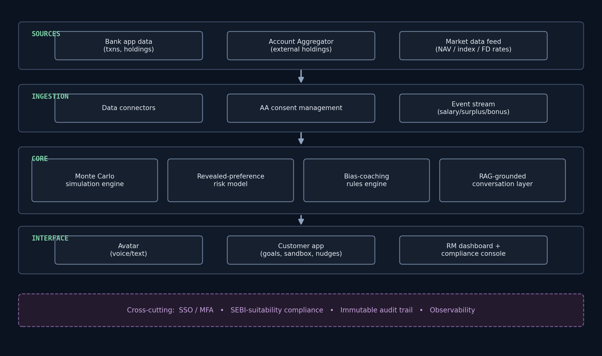
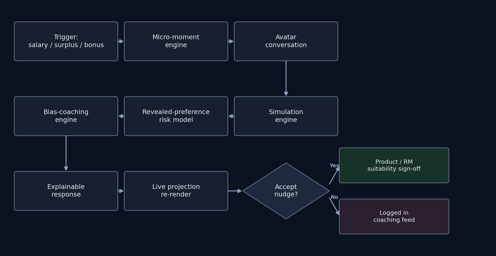

# Architecture

## Overview

Twinfolio is a single Next.js + Express application (no separate ML microservice — see [Why one JS stack](#why-one-js-stack) below) built around four layers: **Sources → Ingestion → Core → Interface**, with cross-cutting auth, compliance, audit, and observability concerns applied throughout.

### Sources

- Bank mobile-app data (transactions, existing holdings — MF, FD, insurance)
- Account Aggregator (consent-based pull of externally-held investments)
- Market data feed (NAV / index levels / FD rate cards)

### Ingestion
- Data connectors for each source above
- AA consent management (request → approve → fetch → revoke lifecycle)
- Event stream detecting salary credits, large transactions, and surplus cash — feeds the micro-moment trigger engine

### Core
- **Monte Carlo simulation engine** ✅ built & live — plain JS, no library needed; forward-projects net worth under different contribution/spending scenarios (`backend/src/services/simulationEngine.js`, wired into `/api/simulate` and the agent's `runWhatIfSimulation` tool)
- **Revealed-preference risk model** ✅ built & live — not a trained classifier; Groq/LLM structured-output reasoning (via LangChain.js) directly over transaction/portfolio-event history, returning a schema-constrained `{riskTolerance, biasFlags[], reasoning}` object rather than free text (`backend/src/agent/riskProfileModel.js`, wired into `/api/risk-profile`). Currently runs on synthetic presets, not real bank data — real assessments aren't yet persisted anywhere (MongoDB model exists, not yet called from this route).
- **Bias-coaching rules engine** — folded into the risk model above rather than built as a separate component; the risk model's `biasFlags[].explanation` field *is* the coaching output.
- **Agentic conversation layer (LangChain.js)** ✅ built & live, ⚠️ RAG not yet connected. The avatar is a tool-calling agent (`backend/src/agent/financialTwinAgent.js`) with two real tools today:
  - `runWhatIfSimulation()` → Monte Carlo engine — **verified**: returns real computed values, not hallucinated ones (cross-checked against direct API calls)
  - `calculateRequiredContribution()` → goal back-calculation — **verified** the same way
  - `getRiskProfile()`, `checkMicroMoment()`, `escalateToRM()` — designed, not yet implemented as agent tools
  - RAG over Qdrant embeddings is built and verified **standalone** (`backend/src/db/qdrant.js`) but not yet called from the agent — right now the agent has no memory of past conversations.

### Interface
- Avatar (2D, Lottie — voice/text reactive)
- Customer app (goals, scenario sandbox, nudge inbox)
- RM dashboard + suitability/compliance console

### Cross-cutting
SSO/MFA auth · SEBI-suitability compliance checks · immutable audit trail (every recommendation logged with model version) · observability (simulation latency, conversation fallback rate, market-data freshness)

## Process flow

A micro-moment trigger (salary/surplus/bonus) or a direct customer question both enter through the avatar conversation layer, which calls the simulation engine and the revealed-preference risk model, passes through the bias-coaching engine, and returns an explainable response with a live-re-rendered projection. If the customer accepts a nudge, it's routed to product/RM suitability sign-off; otherwise it's logged to the coaching feed for later.

## Mobile integration strategy

The official problem statement asks for an app "integrated into the bank's mobile application." Next.js is a web framework, so this is resolved by shipping **one codebase to three surfaces**:

1. **Bank's native mobile app** — the Next.js app embedded via in-app WebView / deep link. This is what satisfies the "integrated into the mobile app" requirement without a separate native rebuild.
2. **Installable responsive PWA** — standalone, add-to-homescreen.
3. **RM/advisor web dashboard** — desktop browser, internal use.

## Data model notes

All three below are built and verified against the real cloud services (see TESTING.md) — real insert/read/delete or real semantic search, each confirmed working. **None are wired into the live routes yet** — `/api/chat` and `/api/risk-profile` currently run entirely stateless, no login, nothing persists between requests.

- **MongoDB Atlas** — `ConversationLog` and `RiskAssessment` models exist (`backend/src/db/models/`) for conversation logs, nudge history, simulation snapshots.
- **Turso** (libSQL/SQL) — `profiles` table (schema + migration pushed) for accounts/goals/audit-trail-shaped data that benefits from relational integrity.
- **Qdrant** — collection + payload index set up, embeddings generated locally via `@xenova/transformers` (`Xenova/all-MiniLM-L6-v2`, 384 dimensions) — no external embeddings API needed, resolving the earlier open question about which embeddings provider to pair with Claude/Groq. Real semantic search confirmed working with cross-user isolation verified (a filter on `userId`, backed by a payload index Qdrant Cloud requires explicitly).

## Why one JS stack

Pieces that originally looked like they needed Python, or a separate ML library, don't:

- **Monte Carlo simulation** — not actually ML, just numerical simulation. Plain JS loops/random sampling handle this natively.
- **Revealed-preference risk/bias model** — no trained classifier at all. Groq (via LangChain.js structured output) reasons directly over behavioral history and returns a schema-constrained result. Trade-off: less deterministic run-to-run than a trained classifier — mitigated with near-zero temperature, a constrained output schema, and full prompt/response audit logging. Worth revisiting only if this becomes a production system needing formally validated/backtested risk scoring.
- **Agentic/RAG orchestration** — LangChain.js (the JS/TS port of LangChain) covers tool-calling agents and RAG retrieval natively.
- **Embeddings** — `@xenova/transformers` runs the embedding model locally in-process, no Python and no external API needed either.

Collapsing to one language removes the cross-service REST call, simplifies deployment to a single target, and matches a 4-person team's ability to context-switch across the whole stack.
