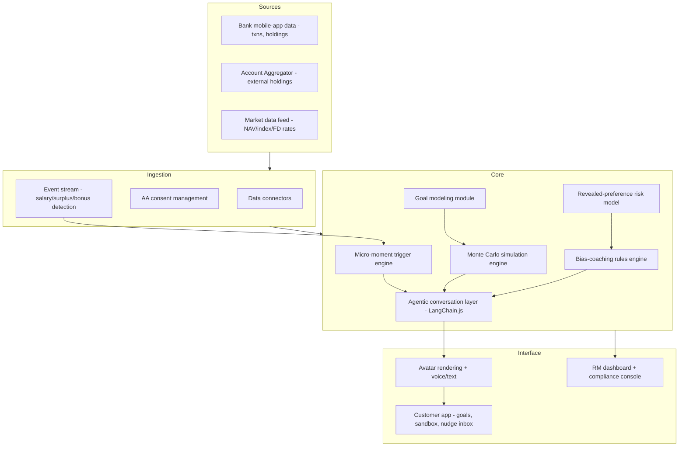

> Structured to match the official "Prototype Submission Deck" template (IDBI Innovate 2026). Sections marked **[TBD post-build]** can only be completed once an actual prototype exists (Aug 2–16 phase) — everything else is ready now.

# Team Details

a. **Team name:** [Fill in]
b. **Team leader name:** Ronik Dedhia
c. **Problem Statement:** Track 01 — Wealth Advisory (Wealth Advisory / Conversational AI / Mobile Banking)

> Wealth management and advisory services remain fragmented and largely inaccessible to a large number of customers. Absence of comprehensive customer investment behaviour and spending habits limits the ability to provide timely, personalized, data-driven guidance.
>
> **Expected Outcome:** An AI-powered Digital Wealth Management (Avatar Based) Application, integrated into the bank's mobile application, delivering personalized and scalable wealth advisory services through an intuitive digital interface.

---

# Brief about the idea

**Pitch line:** "Not a chatbot with a face — a living simulation of your financial future that you can talk to, argue with, and watch change in real time as you make decisions."

The Financial Digital Twin is an avatar that is the actual simulation engine, not a chat skin bolted onto generic robo-advisor logic. It models the customer's real spending, income, and investment behavior, and lets them converse directly with a visual projection of their own future net worth — "what if I invest ₹5,000/month" re-renders the simulated retirement corpus, home down-payment timeline, and education fund live, in conversation. Underneath, a revealed-preference risk model infers true risk tolerance and behavioral biases from actual past decisions (not a static questionnaire), and the twin proactively surfaces advice at real financial moments — salary credit, surplus cash, a bonus — instead of waiting to be asked.

---

# Opportunities

**How different is it from other existing ideas?**
Most "avatar-based advisor" submissions in this track will default to a conversational UI layer on top of standard robo-advisor logic — the avatar is decorative. Here the avatar *is* the simulation engine: every response is a live re-computation of the customer's actual financial-future projection, parameterized on their own transaction and portfolio data, not a generic answer from a knowledge base.

**How will it be able to solve the problem?**
- Directly targets the stated gap — "absence of comprehensive customer investment behaviour and spending habits" — by fusing bank transaction data with AA-aggregated external holdings into one behavioral profile.
- Converts static, one-time risk questionnaires into a continuously-updating revealed-preference model, producing genuinely personalized guidance instead of a one-size risk bucket.
- Micro-moment advisory delivers timely, proactive guidance instead of advice the customer has to remember to seek out — directly answering "timely... data-driven guidance."
- Scales advisory to the mass-market segment the problem statement calls "largely inaccessible," since the twin doesn't require a human RM to be personalized.

**USP of the proposed solution:**
1. Avatar-as-simulation-engine, not avatar-as-chat-skin — a defensible technical differentiator from the likely competing pitches.
2. Revealed-preference risk profiling from actual behavior, replacing static self-reported questionnaires.
3. Bias-coaching: the twin actively corrects panic-selling, FD-overconcentration, and scheme-chasing patterns with counterfactual evidence from the customer's own history.
4. Micro-moment advisory — proactive nudges at salary credit / surplus / bonus events, not reactive Q&A.
5. Built-in suitability/compliance console addressing the regulatory objection (SEBI investment-adviser norms) judges are likely to raise against AI-driven investment advice.

---

# List of features offered by the solution

**Data & Ingestion**
- Bank mobile-app connectors: transaction history, existing holdings (MF, FD, insurance), goal-tracking data.
- Consent-based Account Aggregator pull for externally-held investments.
- Live market-data feed integration (NAVs, index levels, FD rate cards).
- Event stream for salary-credit, large-transaction, and surplus-cash detection.

**Simulation & Modeling Engine**
- Monte Carlo–based financial projection engine, parameterized per customer.
- Goal modeling module (retirement, home purchase, education) with required-contribution back-calculation.
- Revealed-preference risk & bias model trained on transaction/portfolio-event history.
- Bias-coaching rules engine mapping detected patterns to coaching scripts and counterfactual return calculations.
- Micro-moment trigger engine (rule + ML hybrid) generating prioritized nudge candidates.
- Agentic conversation layer (LangChain.js) turning model outputs into explainable natural-language responses, via tool-calling into the simulation/risk/bias engines rather than plain RAG retrieval+generation.
- Full explainability layer tracing every recommendation back to its driving data points.

**Avatar / Conversational Interface**
- 2D avatar rendering (Lottie) with expression-reactive responses.
- LLM-backed agent (LangChain.js), grounded via RAG (Qdrant) on the customer's own financial data.
- Live re-simulation UI: projection re-renders in real time as the conversation progresses.
- Voice interface (stretch goal).
- Hindi + regional-language support.

**Customer-Facing App**
- Goal dashboard with trajectory-vs-target tracking and one-tap "talk to your twin."
- Scenario sandbox for saving/comparing multiple "what if" projections.
- Bias & coaching feed with outcome tracking.
- Nudge inbox (accept/dismiss/snooze) linking directly into the relevant investment product.
- Consolidated portfolio-health view across bank-held and AA-aggregated holdings.

**Advisor/Bank-Facing App**
- RM dashboard surfacing customers with high-value nudges or significant bias flags for human follow-up.
- Suitability/compliance console logging every AI recommendation with its explainability trace.
- Product configuration UI for eligibility/suitability rules, no engineering changes required.
- Analytics dashboard: nudge-acceptance rates, AUM growth attribution, cohort engagement metrics.

**Platform**
- SSO integration with the bank's existing mobile-app auth, MFA on high-value confirmations.
- Regulatory compliance layer: SEBI suitability checks, mandatory disclosures at the right conversation points.
- Immutable audit trail tied to model version per recommendation.
- Observability on simulation latency, conversation-quality/fallback rate, market-data freshness SLAs.
- Encryption of portfolio/PII data, tokenized identifiers, AA-consent lifecycle management.
- CI/CD with projection-engine regression tests and conversation-layer prompt regression tests.

---

# Process flow diagram or Use-case diagram

```mermaid
flowchart LR
    A[Customer opens app / twin proactively nudges] --> B[Event stream detects trigger - salary/surplus/bonus]
    B --> C[Micro-moment trigger engine]
    C --> D[Avatar initiates conversation]
    D --> E[Customer asks 'what if' scenario]
    E --> F[Simulation engine: Monte Carlo projection]
    F --> G[Revealed-preference risk model adjusts guidance]
    G --> H[Bias-coaching rules engine checks for bias pattern]
    H --> I[Agent - LangChain.js - generates explainable response]
    I --> J[Avatar responds + live projection re-renders]
    J --> K{Customer accepts nudge?}
    K -->|Yes| L[Routed to product / RM for suitability sign-off]
    K -->|No/Snooze| M[Logged in coaching feed for later]
    L --> N[Suitability/compliance console logs recommendation]
```

---

# Wireframes/Mock diagrams of the proposed solution (optional)

**[TBD post-build]** — to be added once goal dashboard, scenario sandbox, and avatar conversation UI mocks are produced (Sprint 1–2).

---

# Architecture diagram of the proposed solution

Cross-cutting: SSO/MFA auth, SEBI-suitability compliance layer, immutable audit trail, observability (Prometheus/Grafana + OpenTelemetry), encryption/tokenization — applied across every layer above.

---

# Technologies to be used in the solution

| Layer | Stack |
|---|---|
| Frontend | Next.js (React), shipped to bank's mobile app via in-app WebView / deep link, plus installable PWA and RM web dashboard — see Mobile Integration below |
| Avatar rendering | Lottie (2D) |
| Conversational engine | LLM + RAG + agentic tool-calling (LangChain.js) — agent retrieves customer context via RAG (Qdrant) and calls tools (simulation engine, risk model, bias engine, trigger engine) rather than just generating text |
| Backend / API | Express (Node.js) — single service, app/API + ML + agent orchestration layer |
| Simulation engine | Plain JS — Monte Carlo, no library needed |
| Modeling | Groq/LLM structured-output reasoning (revealed-preference/bias model — not a trained classifier) |
| Storage | MongoDB Atlas (conversation logs, nudge history, simulation snapshots) + Turso (SQL: accounts, goals, audit trail) + Qdrant (vector store for RAG embeddings, embedded locally via `@xenova/transformers`) |
| Infra | Vercel (frontend), Render/Railway (Express service), MongoDB Atlas managed cluster, GitHub Actions (CI/CD) |
| Auth | Clerk (real bank OIDC/SSO not reachable in the hackathon sandbox) |
| Observability | Prometheus + Grafana, OpenTelemetry |

### Mobile integration

Next.js is a web framework, while the ask is for an app "integrated into the bank's mobile application." Resolved by shipping one Next.js codebase to three surfaces: the bank's native mobile app (via in-app WebView/deep link — this is what satisfies the mobile-integration requirement), an installable responsive PWA, and the RM/advisor web dashboard.

---

# Estimated implementation cost (optional)

Indicative only — to be refined once actual sandbox/cloud pricing and licensing terms (LLM API usage, avatar rendering assets) are known.

| Item | Estimate |
|---|---|
| Cloud infra (sandbox → pilot scale, 2 months) | ₹[TBD] |
| LLM API usage (conversation layer) | ₹[TBD] |
| Avatar rendering assets/licensing | ₹[TBD] |
| Team effort (4 people × 2 months) | ₹[TBD] |
| **Total (indicative)** | ₹[TBD] |

---

# Snapshots of the prototype

**[TBD post-build]** — populate with avatar conversation screens, goal dashboard, and scenario sandbox screenshots once the prototype is running (target: Sprint 2–3).

---

# Prototype Performance report/Benchmarking

**Partial — real results so far, full report still pending:**
- Agentic tool-calling verified accurate: asking the agent "how much do I need to save monthly to hit my goal?" returned the exact same figure (₹6,001.10) as calling the deterministic calculation directly — confirms the agent relays real computed values rather than plausible-sounding hallucinated ones.
- Risk/bias model tested across 4 synthetic behavioral presets — correctly differentiated conservative/moderate/aggressive profiles and, importantly, returned zero false-positive bias flags on the clean "disciplined investor" case. One labeling-accuracy bug found and fixed via prompt tuning during testing (see TESTING.md).
- Data layer (Turso, MongoDB, Qdrant) round-trip correctness confirmed against the real cloud services; Qdrant semantic search confirmed returning genuinely relevant results (not just exact-string matches) with verified cross-user data isolation.
- **Still missing:** simulation-engine response latency numbers, conversation-layer fallback/failure rate under load — to be populated once the app is under more realistic traffic.

Full detail and reproducible curl commands: see `TESTING.md` in the repo.

---

# Additional Details/Future Development (if any)

- **Team & build plan (4 people, 2 months):**
  - Engineer A — Backend/Platform: data connectors, simulation-engine service, auth/SSO, infra, CI/CD.
  - Engineer B — ML/Conversational AI: revealed-preference model, bias-coaching engine, agentic conversation layer (LangChain.js, RAG over Qdrant, tool-calling), trigger engine.
  - Engineer C — Frontend/Avatar: avatar rendering, mobile UI, scenario sandbox, live re-simulation visualizations.
  - Engineer D — Product/Compliance/Full-stack: suitability console, RM dashboard, synthetic data, QA, demo narrative.
  - Sprint 1–2 (Wk 1–4): synthetic behavioral dataset, simulation engine v1, avatar tech-spike, revealed-preference model v1, goal dashboard + sandbox UI.
  - Sprint 3 (Wk 5–6): real sandbox data integration (post Aug 4 access), micro-moment trigger engine, bias-coaching scripts tuned, RM dashboard, compliance console v1.
  - Sprint 4 (Wk 7–8): voice interface (stretch), analytics dashboard, security/audit hardening, demo-day polish.
- **Actual progress against this plan:** Sprint 1–2 scope is essentially complete (simulation engine, goal dashboard, agentic conversation layer, and risk model are all built and verified with real API calls — ahead of a pure "v1", closer to a working v1.5). Part of Sprint 3 is also done early (the data layer itself), but real sandbox data, the micro-moment trigger engine, the RM dashboard, and auth/persistence wiring into the live routes are all still outstanding — currently the app runs stateless with no login.
- **Future development beyond hackathon scope:** extend the twin to joint/family financial planning (shared goals across household accounts); add a "what would a financial advisor say" human-escalation blend for high-net-worth edge cases the model flags as low-confidence.

---

# Links

- **GitHub Public Repository:** [TBD post-build]
- **Demo Video Link (3 minutes):** [TBD post-build]
- **Final Product Link:** [TBD post-build]
